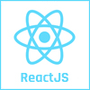
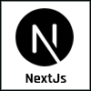

<h3>Hi, I'm Khaled ABBACI</h3>

<h4>Stack</h4>

    
    
    
    
    
    
    
    

<h4>About me</h4>
<ul>
    <li><b>Function:</b> Software Engineer</li>
    <li><b>Email:</b> <a href="mailto:abbacikhaled@gmail.com">abbacikhaled@gmail.com</a></li>
    <li><b>Phone number:</b> +32470653497</li>
    <li><b>Location:</b> Brussels, Belgium</li>
</ul>

<h4>Social Networks</h4>

    
    
    
    

