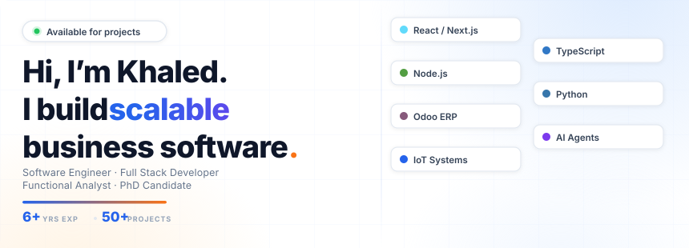

&ensp;

&ensp;

---

## About Me

Software Engineer with **6+ years of experience** designing and building scalable web applications, enterprise ERP platforms, and AI-driven solutions — primarily with JavaScript/TypeScript, Python, and Odoo.

**PhD candidate** in IoT & Recommender Systems &nbsp;·&nbsp; **1 IEEE publication** &nbsp;·&nbsp; Based in **Belgium 🇧🇪** &nbsp;·&nbsp; Available **remote worldwide 🌍**

---

## Tech Stack

**Frontend**

**Backend**

**ERP & Research**

---

## GitHub Stats

<picture>
  <source media="(prefers-color-scheme: dark)" srcset="https://github-readme-stats.vercel.app/api?username=AbbaciKhaled&show_icons=true&hide_border=true&title_color=4493f8&icon_color=F97316&text_color=e6edf3&bg_color=0d1117&include_all_commits=true" />
  
</picture>
&ensp;
<picture>
  <source media="(prefers-color-scheme: dark)" srcset="https://github-readme-stats.vercel.app/api/top-langs/?username=AbbaciKhaled&layout=compact&hide_border=true&title_color=4493f8&text_color=e6edf3&bg_color=0d1117&langs_count=6" />
  
</picture>

---

## What I Build

| Area | Technologies & Details |
|---|---|
| ⚡ **Full-Stack Web** | React · Next.js · Node.js · Python · TypeScript · REST APIs |
| 🟣 **Odoo ERP** | Custom modules · v14 → v19 migrations · Multi-company · Integrations |
| 🔬 **Research & AI** | IoT systems · Recommender systems · AI agents · IEEE-published |
| 📦 **Open Source** | KPM Libraries · npm packages · developer utilities |

---

## Trusted Collaborations

`Horiatech` `WeOne IT` `KSM-IT Consulting` `Group S` `Clubit` `DKS` `OpenScaler` `USTHB` and 15+ more organizations across Belgium, France, and Algeria.

---

**Open to freelance missions · Long-term partnerships · Full-time opportunities**

[khaledabbaci.com](https://khaledabbaci.com) &nbsp;·&nbsp; [abbacikhaled@gmail.com](mailto:abbacikhaled@gmail.com)

